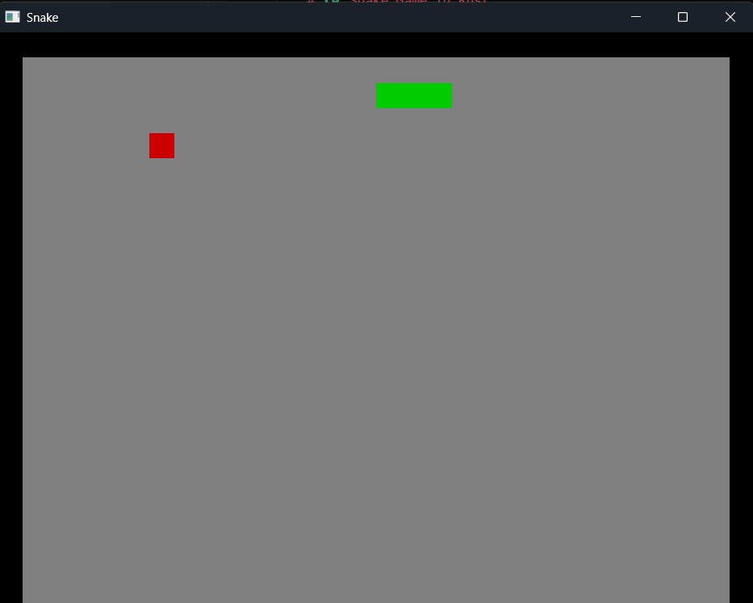
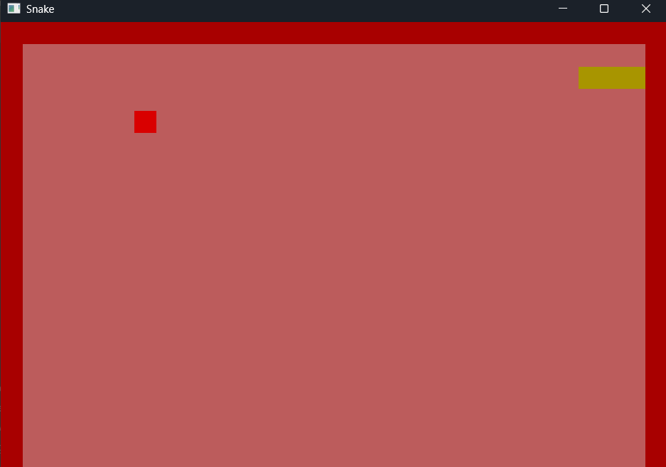
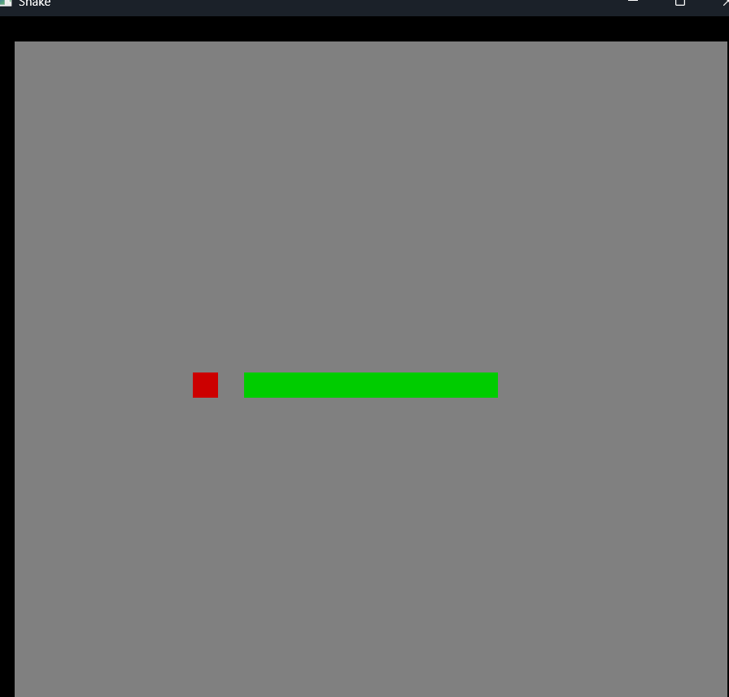

# 🐍 Snake Game in Rust

A classic Snake Game built using **Rust**. The game demonstrates core game development concepts such as game loops, keyboard input handling, collision detection, and score tracking. Control the snake, collect apples to grow longer, and avoid colliding with the walls or yourself.

---

## 📖 Project Overview

This project is a simple implementation of the classic Snake Game developed in Rust. It was created to explore Rust's performance and safety while building an interactive desktop game with clean and modular code.

---

## ✨ Features

* Classic Snake gameplay
* Smooth snake movement
* Random apple spawning
* Snake grows after eating apples
* Real-time score tracking
* Collision detection with walls and the snake's body

---

## 🛠 Requirements

* Rust (latest stable version)
* Cargo

Verify the installation:

```bash
rustc --version
cargo --version
```

---

## 📂 Project Structure

```text
snake-game/
├── src/                 # Source code
├── Cargo.toml           # Project configuration
├── Cargo.lock           # Dependency lock file
├── README.md            # Project documentation
└── target/              # Build files (generated automatically)
```

---

## ▶️ How to Run

Clone the repository:

```bash
git clone https://github.com/Raghav-Bhatia4047/snake-game.git
```

Navigate to the project directory:

```bash
cd snake-game
```

Run the game:

```bash
cargo run
```

---

## 🎮 Controls

| Key | Action     |
| --- | ---------- |
| ↑   | Move Up    |
| ↓   | Move Down  |
| ←   | Move Left  |
| →   | Move Right |

---

## 🎥 Demo

**Gameplay Video:**  
https://youtu.be/obB16YK18gk

### 📸 Screenshots

#### 🎮 Game



#### 💀 Game Over



#### 🐍 Snake and Food


---

## 🚀 Future Enhancements

* Pause and Resume functionality
* Restart without restarting the application
* High score system
* Game Over screen with restart option
* Progressive difficulty and speed increase
* Sound effects and background music
* Improved UI and animations

---

## ⚠️ Known Issues

* High scores are not saved between sessions.
* Pause and restart functionality are not implemented.
* No dedicated Game Over screen.
